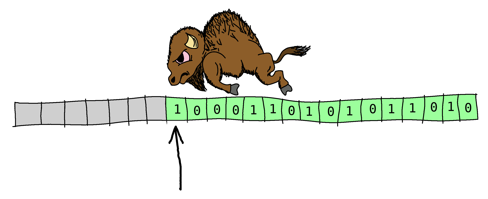

<style>
h1 {
  font-size: 3em !important;
  font-weight: bold;
}

.slidev-vclick-target {
  transition: opacity 700ms ease !important;
}
</style>

# Oxc 1.0

## 5 item wish list

<div style="display: flex; justify-content: center; align-items: center; gap: 40px; margin-top: 40px;">
  
</div>

---
transition: fade-out
---

# AST

````md magic-move
```rs
pub struct Function<'a> {
    pub node_id: Cell<NodeId>,
    pub span: Span,
    pub r#type: FunctionType,
    pub id: Option<BindingIdentifier<'a>>,
    pub params: Box<'a, FormalParameters<'a>>,
    pub body: Option<Box<'a, FunctionBody<'a>>>,
    pub scope_id: Cell<Option<ScopeId>>,
}
```
```rs
pub struct FunctionDeclaration<'a> {
    pub node_id: Cell<NodeId>,
    pub span: Span,
    pub id: BindingIdentifier<'a>,
    pub params: Box<'a, FormalParameters<'a>>,
    pub body: Option<Box<'a, FunctionBody<'a>>>,
    pub scope_id: Cell<Option<ScopeId>>,
}

pub struct FunctionExpression<'a> {
    pub node_id: Cell<NodeId>,
    pub span: Span,
    pub id: Option<BindingIdentifier<'a>>,
    pub params: Box<'a, FormalParameters<'a>>,
    pub body: Box<'a, FunctionBody<'a>,
    pub scope_id: Cell<Option<ScopeId>>,
}
```
````

---
transition: slide-left
---

# AST

````md magic-move
```rs
pub struct FunctionDeclaration<'a> {
    pub node_id: Cell<NodeId>,
    pub span: Span,
    pub id: BindingIdentifier<'a>,               // Not optional, bound in outer scope
    pub params: Box<'a, FormalParameters<'a>>,
    pub body: Option<Box<'a, FunctionBody<'a>>>, // Optional
    pub scope_id: Cell<Option<ScopeId>>,
}

pub struct FunctionExpression<'a> {
    pub node_id: Cell<NodeId>,
    pub span: Span,
    pub id: Option<BindingIdentifier<'a>>,        // Optional, bound in own scope
    pub params: Box<'a, FormalParameters<'a>>,
    pub body: Box<'a, FunctionBody<'a>,           // Not optional
    pub scope_id: Cell<Option<ScopeId>>,
}
```
````

<v-click at="1">

* Ditto `ClassDeclaration` + `ClassExpression`
* Matches ESTree
* Stop having to `.unwrap()` on `id`

</v-click>

---
transition: slide-left
clicks: 8
---

# Pointer tagging

<div style="display: flex; gap: 24px;">
<div v-click="1" style="flex: 1;">

```rs
enum Expression<'a> {
    BooleanLiteral(Box<'a, BooleanLiteral>),
    NullLiteral(Box<'a, NullLiteral>),
    NumericLiteral(Box<'a, NumericLiteral<'a>>),
    BigIntLiteral(Box<'a, BigIntLiteral<'a>>),
    RegExpLiteral(Box<'a, RegExpLiteral<'a>>),
    StringLiteral(Box<'a, StringLiteral<'a>>),
    TemplateLiteral(Box<'a, TemplateLiteral<'a>>),
    // ...
}
```

</div>
<div v-click="6" style="flex: 1;">

````md magic-move {at:7}
```rs
struct BinaryExpression<'a> {
    node_id: u32,
    span: Span,
    left: Expression<'a>,
    operator: BinaryOperator,
    right: Expression<'a>,
}
```
```rs
struct BinaryExpression<'a> {
    node_id: u32,
    span: Span,
    left: Compact<Expression<'a>>,
    operator: BinaryOperator,
    right: Compact<Expression<'a>>,
}
```
````

<div style="font-family: monospace; font-size: 1.5em; font-weight: bold; color: #aaa; margin-top: 8px; text-align: center;">
  {{ $clicks >= 7 ? '32 bytes' : '48 bytes' }}
</div>

</div>
</div>

<div v-click="2" style="margin-top: 32px; font-family: monospace; font-size: 0.75em;">
  <div style="display: flex; align-items: flex-start; gap: 32px;">
  <div>
  <div style="position: relative; display: inline-block;">
    <div style="display: flex; border-radius: 6px; overflow: hidden;">
      <div :style="{ display: 'flex', opacity: $clicks >= 5 ? 0 : 1, transition: 'opacity 0.4s ease' }">
        <div style="width: 40px; height: 48px; background: repeating-linear-gradient(45deg, #2a2a2a, #2a2a2a 3px, #444 3px, #444 4px); border-right: 1px solid #555;"></div>
        <div style="width: 40px; height: 48px; background: repeating-linear-gradient(45deg, #2a2a2a, #2a2a2a 3px, #444 3px, #444 4px); border-right: 1px solid #444;"></div>
        <div style="width: 40px; height: 48px; background: repeating-linear-gradient(45deg, #2a2a2a, #2a2a2a 3px, #444 3px, #444 4px); border-right: 1px solid #444;"></div>
        <div style="width: 40px; height: 48px; background: repeating-linear-gradient(45deg, #2a2a2a, #2a2a2a 3px, #444 3px, #444 4px); border-right: 1px solid #444;"></div>
        <div style="width: 40px; height: 48px; background: repeating-linear-gradient(45deg, #2a2a2a, #2a2a2a 3px, #444 3px, #444 4px); border-right: 1px solid #444;"></div>
        <div style="width: 40px; height: 48px; background: repeating-linear-gradient(45deg, #2a2a2a, #2a2a2a 3px, #444 3px, #444 4px); border-right: 1px solid #444;"></div>
        <div style="width: 40px; height: 48px; background: repeating-linear-gradient(45deg, #2a2a2a, #2a2a2a 3px, #444 3px, #444 4px); border-right: 1px solid #444;"></div>
        <div style="width: 40px; height: 48px; background: repeating-linear-gradient(45deg, #2a2a2a, #2a2a2a 3px, #444 3px, #444 4px); border-right: 1px solid #555;"></div>
      </div>
      <div style="width: 40px; height: 48px; background: #34b99d; border-right: 1px solid #4a7a4a;"></div>
      <div style="width: 40px; height: 48px; background: #34b99d; border-right: 1px solid #4a7a4a;"></div>
      <div style="width: 40px; height: 48px; background: #34b99d; border-right: 1px solid #4a7a4a;"></div>
      <div style="width: 40px; height: 48px; background: #34b99d; border-right: 1px solid #4a7a4a;"></div>
      <div style="width: 40px; height: 48px; background: #34b99d; border-right: 1px solid #4a7a4a;"></div>
      <div style="width: 40px; height: 48px; background: #34b99d; border-right: 1px solid #4a7a4a;"></div>
      <div style="width: 40px; height: 48px; background: #34b99d; border-right: 1px solid #4a7a4a;"></div>
      <div style="width: 40px; height: 48px; position: relative; background: #34b99d;">
        <div v-click="3" style="position: absolute; inset: 0; background: repeating-linear-gradient(45deg, #2a2a2a, #2a2a2a 3px, #444 3px, #444 4px);"></div>
      </div>
    </div>
    <!-- Border overlay: surrounds all 16 cells normally, shrinks to bytes 8-15 at click 5 -->
    <div :style="{
      position: 'absolute',
      top: '-2px', bottom: '-2px',
      left: $clicks >= 5 ? '318px' : '-2px',
      right: '-2px',
      border: '2px solid #555',
      borderRadius: '6px',
      pointerEvents: 'none',
      zIndex: 3,
    }"></div>
    <!-- Green discriminant cell: slides from byte 0 to byte 15 on click 4 -->
    <div :style="{
      position: 'absolute', top: '0', left: '0',
      width: '40px', height: '48px',
      background: '#00bc5e',
      zIndex: 10,
      transform: $clicks >= 4 ? 'translateX(600px)' : 'translateX(0)',
      transition: $clicks >= 4 ? 'transform 0.6s ease' : 'none',
    }"></div>
  </div>
  <!-- Byte index labels -->
  <div style="display: flex; font-size: 0.7em; margin-top: 8px; color: #aaa;">
    <div :style="{ display: 'flex', opacity: $clicks >= 5 ? 0 : 1, transition: 'opacity 0.4s ease' }">
      <div style="width: 40px; text-align: center;">0</div>
      <div style="width: 40px; text-align: center;">1</div>
      <div style="width: 40px; text-align: center;"></div>
      <div style="width: 40px; text-align: center;"></div>
      <div style="width: 40px; text-align: center;"></div>
      <div style="width: 40px; text-align: center;"></div>
      <div style="width: 40px; text-align: center;"></div>
      <div style="width: 40px; text-align: center;">7</div>
    </div>
    <div style="width: 40px; text-align: center;">{{ $clicks >= 5 ? '0' : '8' }}</div>
    <div style="width: 40px; text-align: center;"></div>
    <div style="width: 40px; text-align: center;"></div>
    <div style="width: 40px; text-align: center;"></div>
    <div style="width: 40px; text-align: center;"></div>
    <div style="width: 40px; text-align: center;"></div>
    <div style="width: 40px; text-align: center;"></div>
    <div style="width: 40px; text-align: center;">{{ $clicks >= 5 ? '7' : '15' }}</div>
  </div>
  <!-- Field annotations -->
  <div style="display: flex; margin-top: 6px;">
    <div :style="{ display: 'flex', opacity: $clicks >= 5 ? 0 : 1, transition: 'opacity 0.4s ease' }">
      <div style="width: 40px; text-align: center; color: #00e676;">Disc rim</div>
      <div style="width: 280px; text-align: center; color: #666;">padding</div>
    </div>
    <div style="width: 280px; text-align: center; color: #34b99d;">Pointer</div>
    <div v-click="3" style="width: 40px; text-align: center;">
      <span :style="{ color: $clicks >= 4 ? '#00e676' : '#aaa' }">{{ $clicks >= 4 ? 'Disc rim' : 'High bits' }}</span>
    </div>
  </div>
  </div>
  <div style="align-self: center; margin-top: -70px; font-size: 2em; font-weight: bold; color: #aaa; white-space: nowrap;">
    {{ $clicks >= 5 ? '8 bytes' : '16 bytes' }}
  </div>
  </div>
  <div v-click="8" style="margin-top: 28px; font-size: 3em; font-weight: bold; color: #66bb6a;">
    15%–20% reduction in AST memory
  </div>
</div>

---
transition: slide-left
---

# What's taking the time?

<div style="font-size: 2em">

* <span style="color: #F74C00">**Rust side:**</span> Serialize AST to JSON 🐌
* <span style="color: #A52B00">**Transfer:**</span> Send JSON string to JS 🐌
* <span style="color: #F7DF1E">**JS side:**</span> `JSON.parse()` 🐌

</div>

---
transition: fade-out
---

# Serialization format

<div style="font-size: 2em">

* Compact
* Well specified
* Fast to serialize
* Fast to deserialize

</div>

---
transition: fade-out
---

# AST in memory

<style>
table {
  line-height: 1.2;
}
table td, table th {
  padding: 2px 8px;
}
table thead th {
  border-bottom: 3px solid #333;
}
.blue {
  color: #4A90E2;
}
.blur-on-text {
  transition: filter 0.5s ease;
}
/* When the text overlay is visible, blur the code */
body:has(.text-overlay:not(.slidev-vclick-hidden)) .blur-on-text {
  filter: blur(3px);
}
</style>

<div style="display: flex; gap: 3rem; height: 100%;">
  <div style="flex: 1;" class="blur-on-text">

```rs
pub struct Program<'a> {
    pub span: Span,
    pub source_type: SourceType,
    pub body: Vec<'a, Statement<'a>>,
}

pub struct Span {
    pub start: u32,
    pub end: u32,
}

pub enum SourceType {
    Module,
    Script,
}

pub enum Statement<'a> {
    BlockStatement(Box<'a, BlockStatement<'a>>),
    BreakStatement(Box<'a, BreakStatement<'a>>),
    ContinueStatement(Box<'a, ContinueStatement<'a>>),
    // ...
}
```

  </div>
  <div v-click style="flex: 1; position: relative;">

<svg style="position: absolute; top: 0; left: 0; width: 100%; height: 100%; pointer-events: none; z-index: 10;">
  <defs>
    <marker id="arrowhead" markerWidth="10" markerHeight="7"
     refX="9" refY="3.5" orient="auto">
      <polygon points="0 0, 10 3.5, 0 7" fill="#ff6b6b" />
    </marker>
  </defs>
  <path d="M 350 140 C 420 140, 420 202, 350 202" stroke="#ff6b6b" stroke-width="2" fill="none" marker-end="url(#arrowhead)" />
  <path d="M 350 264 C 420 264, 420 364, 300 404" stroke="#ff6b6b" stroke-width="2" fill="none" marker-end="url(#arrowhead)" />
  <path d="M 350 365 C 420 365, 420 397, 300 429" stroke="#ff6b6b" stroke-width="2" fill="none" marker-end="url(#arrowhead)" />
</svg>

| **Bytes**                       | **Data**                                                 |
|---------------------------------|----------------------------------------------------------|
| <span class="blue">0-3</span>   | `span.start` (32 bit integer)                            |
| <span class="blue">4-7</span>   | `span.end` (32 bit integer)                              |
| <span class="blue">8</span>     | `SourceType` (0 = `Module`, 1 = `Script`)                |
| <span class="blue">9-15</span>  | -                                                        |
| <span class="blue">16-23</span> | Pointer to `statements` array                            |
| <span class="blue">24-31</span> | Length of `statements` array                             |
| <span class="blue">32</span>    | Statement 1 `type`<br />(e.g. 0 for `BlockStatement`)    |
| <span class="blue">33-39</span> | -                                                        |
| <span class="blue">40-47</span> | Statement 1 pointer                                      |
| <span class="blue">48</span>    | Statement 2 `type`<br />(e.g. 1 for `ContinueStatement`) |
| <span class="blue">49-55</span> | -                                                        |
| <span class="blue">56-63</span> | Statement 2 pointer                                      |
| <span class="blue">64...</span> | ...                                                      |

  </div>
</div>

<div v-click class="text-overlay" style="position: absolute; top: 50%; left: 27%; transform: translate(-50%, -50%); font-size: 2.4em; color: #F74C00; font-weight: bold; text-shadow: 0 0 10px rgba(0, 0, 0, 0.8), 0 0 20px rgba(0, 0, 0, 0.6); z-index: 20;">
  This looks a lot like<br />
  a binary serialization<br />
  format
  <div style="font-size: 2em; text-align: right;">→</div>
</div>

---
transition: fade-out
---

# `#[repr(C)]`

````md magic-move
```rs
pub struct BinaryExpression<'a> {
    pub node_id: u32,             // 4 bytes
    pub span: Span,               // 8 bytes
    pub left: Expression<'a>,     // 16 bytes
    pub operator: BinaryOperator, // 1 byte
    pub right: Expression<'a>,    // 16 bytes
}
```
```rs
pub struct BinaryExpression<'a> { // 56 bytes
    pub node_id: u32,             // 4 bytes
    __padding__: [u8; 4],         // 4 bytes
    pub span: Span,               // 8 bytes
    pub left: Expression<'a>,     // 16 bytes
    pub operator: BinaryOperator, // 1 byte
    __padding__: [u8; 7],         // 7 bytes
    pub right: Expression<'a>,    // 16 bytes
}
```
```rs
#[repr(Rust)]
pub struct BinaryExpression<'a> { // 48 bytes
    pub left: Expression<'a>,     // 16 bytes
    pub right: Expression<'a>,    // 16 bytes
    pub span: Span,               // 8 bytes
    pub node_id: u32,             // 4 bytes
    pub operator: BinaryOperator, // 1 byte
    __padding__: [u8; 3],         // 3 bytes
}
```
```rs
#[repr(C)]
pub struct BinaryExpression<'a> { // 56 bytes
    pub node_id: u32,             // 4 bytes
    __padding__: [u8; 4],         // 4 bytes
    pub span: Span,               // 8 bytes
    pub left: Expression<'a>,     // 16 bytes
    pub operator: BinaryOperator, // 1 byte
    __padding__: [u8; 7],         // 7 bytes
    pub right: Expression<'a>,    // 16 bytes
}
```
````

---
transition: fade-out
---

# Arena allocator



<div v-click style="position: absolute; bottom: 25%; left: 0; right: 0; text-align: center; font-size: 3em;">
= <code>Uint8Array</code>
</div>

<div v-click style="position: absolute; bottom: 10%; left: 0; right: 0; text-align: center; font-size: 3em;">
Sharing state by sharing memory
</div>

---
transition: fade-out
---

# AST in memory

<style>
table {
  line-height: 1.2;
}
table td, table th {
  padding: 2px 8px;
}
table thead th {
  border-bottom: 3px solid #333;
}
.blue {
  color: #4A90E2;
}
.blur-on-text {
  transition: filter 0.5s ease;
}
/* When the text overlay is visible, blur the code */
body:has(.text-overlay:not(.slidev-vclick-hidden)) .blur-on-text {
  filter: blur(3px);
}
</style>

<div style="display: flex; gap: 3rem; height: 100%;">
  <div style="flex: 1;">

```rs
pub struct Program<'a> {
    pub span: Span,
    pub source_type: SourceType,
    pub body: Vec<'a, Statement<'a>>,
}

pub struct Span {
    pub start: u32,
    pub end: u32,
}

pub enum SourceType {
    Module,
    Script,
}

pub enum Statement<'a> {
    BlockStatement(Box<'a, BlockStatement<'a>>),
    BreakStatement(Box<'a, BreakStatement<'a>>),
    ContinueStatement(Box<'a, ContinueStatement<'a>>),
    // ...
}
```

  </div>
  <div style="flex: 1; position: relative;">

<svg style="position: absolute; top: 0; left: 0; width: 100%; height: 100%; pointer-events: none; z-index: 10;">
  <defs>
    <marker id="arrowhead" markerWidth="10" markerHeight="7"
     refX="9" refY="3.5" orient="auto">
      <polygon points="0 0, 10 3.5, 0 7" fill="#ff6b6b" />
    </marker>
  </defs>
  <path d="M 350 140 C 420 140, 420 202, 350 202" stroke="#ff6b6b" stroke-width="2" fill="none" marker-end="url(#arrowhead)" />
  <path d="M 350 264 C 420 264, 420 364, 300 404" stroke="#ff6b6b" stroke-width="2" fill="none" marker-end="url(#arrowhead)" />
  <path d="M 350 365 C 420 365, 420 397, 300 429" stroke="#ff6b6b" stroke-width="2" fill="none" marker-end="url(#arrowhead)" />
</svg>

| **Bytes**                       | **Data**                                                 |
|---------------------------------|----------------------------------------------------------|
| <span class="blue">0-3</span>   | `span.start` (32 bit integer)                            |
| <span class="blue">4-7</span>   | `span.end` (32 bit integer)                              |
| <span class="blue">8</span>     | `SourceType` (0 = `Module`, 1 = `Script`)                |
| <span class="blue">9-15</span>  | -                                                        |
| <span class="blue">16-23</span> | Pointer to `statements` array                            |
| <span class="blue">24-31</span> | Length of `statements` array                             |
| <span class="blue">32</span>    | Statement 1 `type`<br />(e.g. 0 for `BlockStatement`)    |
| <span class="blue">33-39</span> | -                                                        |
| <span class="blue">40-47</span> | Statement 1 pointer                                      |
| <span class="blue">48</span>    | Statement 2 `type`<br />(e.g. 1 for `ContinueStatement`) |
| <span class="blue">49-55</span> | -                                                        |
| <span class="blue">56-63</span> | Statement 2 pointer                                      |
| <span class="blue">64...</span> | ...                                                      |

  </div>
</div>

---
transition: fade-out
clicks: 2
---

# Pointers

<div style="display: flex; flex-direction: column; align-items: center; margin-top: 4rem;">
  <div style="font-family: monospace; font-size: 2em; margin-bottom: 2rem; color: #888; position: relative;">
    <span :style="{ opacity: $clicks >= 2 ? 0 : 1, transition: 'opacity 0.3s' }">64-bit pointer</span>
    <span :style="{ opacity: $clicks >= 2 ? 1 : 0, transition: 'opacity 0.3s', position: 'absolute', left: '50%', transform: 'translateX(-50%)', whiteSpace: 'nowrap' }">32-bit pointer</span>
  </div>
  <div style="display: flex; border: 3px solid #F74C00; border-radius: 8px; overflow: hidden; font-family: monospace; font-size: 2.2em;">
    <div :style="{ padding: '0.6em 1.6em', background: 'rgba(247, 76, 0, 0.15)', opacity: $clicks >= 2 ? 0.07 : 1, transition: 'opacity 0.3s' }">DEAD_BEEF</div>
    <div style="width: 3px; background: #F74C00;"></div>
    <div style="padding: 0.6em 1.6em; background: rgba(165, 43, 0, 0.15);">0123_4567</div>
  </div>
  <div style="display: flex; width: 100%; max-width: 600px; margin-top: 0.5rem;">
    <div :style="{ flex: 1, textAlign: 'center', fontSize: '1.2em', color: '#F74C00', opacity: $clicks >= 2 ? 0.15 : 1, transition: 'opacity 0.3s' }">upper 32 bits</div>
    <div style="flex: 1; text-align: center; font-size: 1.2em; color: #A52B00;">lower 32 bits</div>
  </div>
  <div v-click style="font-size: 2.5em; margin-top: 0.5em; color: #888;">Buffer size 4 GiB, aligned 4 GiB</div>
</div>

---
transition: fade-out
---

# Layout

````md magic-move
```rs
#[repr(C)]
pub struct BinaryExpression<'a> {
    pub node_id: u32,
    pub span: Span,
    pub left: Expression<'a>,
    pub operator: BinaryOperator,
    pub right: Expression<'a>,
}
```
```rs
#[repr(C)]
pub struct BinaryExpression<'a> {
    pub node_id: u32,             // 4 bytes
    pub span: Span,
    pub left: Expression<'a>,
    pub operator: BinaryOperator,
    pub right: Expression<'a>,
}
```
```rs
#[repr(C)]
pub struct BinaryExpression<'a> {
    pub node_id: u32,             // 4 bytes
    pub span: Span,
    pub left: Expression<'a>,
    pub operator: BinaryOperator,
    pub right: Expression<'a>,
}

#[repr(C, u8)]
pub enum Expression<'a> {         // 16 bytes
    BooleanLiteral(Box<'a, BooleanLiteral>) = 0,
    NullLiteral(Box<'a, NullLiteral>) = 1,
    NumericLiteral(Box<'a, NumericLiteral<'a>>) = 2,
    BigIntLiteral(Box<'a, BigIntLiteral<'a>>) = 3,
}

#[repr(u8)]
pub enum BinaryOperator {         // 1 byte
    Equality = 0,
    Inequality = 1,
    StrictEquality = 2,
    // ...
}
```
```rs
#[repr(C)]
pub struct BinaryExpression<'a> { // 48 bytes
    pub node_id: u32,             // 4 bytes
    pub span: Span,               // 8 bytes
    pub left: Expression<'a>,     // 16 bytes
    pub operator: BinaryOperator, // 1 byte
    pub right: Expression<'a>,    // 16 bytes
}

#[repr(C, u8)]
pub enum Expression<'a> {         // 16 bytes
    BooleanLiteral(Box<'a, BooleanLiteral>) = 0,
    NullLiteral(Box<'a, NullLiteral>) = 1,
    NumericLiteral(Box<'a, NumericLiteral<'a>>) = 2,
    BigIntLiteral(Box<'a, BigIntLiteral<'a>>) = 3,
}

#[repr(u8)]
pub enum BinaryOperator {         // 1 byte
    Equality = 0,
    Inequality = 1,
    StrictEquality = 2,
    // ...
}
```
````

---
transition: fade-out
---

# Layout

```rs
assert!(size_of::<BinaryExpression>() == 48);
assert!(align_of::<BinaryExpression>() == 8);
assert!(offset_of!(BinaryExpression, node_id) == 40);
assert!(offset_of!(BinaryExpression, span) == 0);
assert!(offset_of!(BinaryExpression, left) == 8);
assert!(offset_of!(BinaryExpression, operator) == 44);
assert!(offset_of!(BinaryExpression, right) == 24);

assert!(size_of::<Expression>() == 16);
assert!(align_of::<Expression>() == 8);

assert!(size_of::<BinaryOperator>() == 1);
assert!(align_of::<BinaryOperator>() == 1);
```

---
transition: fade-out
---

# Codegen deserializer

```js
function deserializeBinaryExpression(pos) {
  return {
    type: "BinaryExpression",
    left: deserializeExpression(pos + 8),
    operator: deserializeBinaryOperator(pos + 44),
    right: deserializeExpression(pos + 24),
    start: deserializeU32(pos),
    end: deserializeU32(pos + 4),
  };
}

function deserializeExpression(pos) {
  switch (uint8[pos]) {
    case 0: return deserializeBoxBooleanLiteral(pos + 8);
    case 1: return deserializeBoxNullLiteral(pos + 8);
    case 2: return deserializeBoxNumericLiteral(pos + 8);
    case 3: return deserializeBoxBigIntLiteral(pos + 8);
    // ...
  }
}

function deserializeBoxBooleanLiteral(pos) {
  return deserializeBooleanLiteral(uint32[pos >> 2]);
}
```

---
transition: fade-out
---

# Codegen deserializer

```js
function deserializeVecExpression(pos) {
  let arr = [],
    pos32 = pos >> 2;
  pos = uint32[pos32];
  let endPos = pos + uint32[pos32 + 2] * 16;
  for (; pos !== endPos; pos += 16) {
    arr.push(deserializeExpression(pos));
  }
  return arr;
}

function deserializeOptionExpression(pos) {
  if (uint8[pos] === 51) return null;
  return deserializeExpression(pos);
}

function deserializeBool(pos) {
  return uint8[pos] === 1;
}
```

---
transition: fade-out
clicks: 1
---

# ESTree

<div style="overflow: hidden; height: 420px;">
<div :style="{ transform: $clicks >= 1 ? 'translateY(-70%)' : 'translateY(0)', transition: 'transform 1.5s ease-in-out' }">

```js
function deserializeTSModuleDeclaration(pos) {
  let kind = deserializeTSModuleDeclarationKind(pos + 88),
    start = deserializeU32(pos),
    end = deserializeU32(pos + 4),
    declare = deserializeBool(pos + 89),
    node,
    body = deserializeOptionTSModuleDeclarationBody(pos + 64);
  if (body === null) {
    node = {
      type: "TSModuleDeclaration",
      id: null,
      kind,
      declare,
      global: false,
      start,
      end,
    };
    node.id = deserializeTSModuleDeclarationName(pos + 8);
  } else {
    node = {
      type: "TSModuleDeclaration",
      id: null,
      body,
      kind,
      declare,
      global: false,
      start,
      end,
    };
    let id = deserializeTSModuleDeclarationName(pos + 8);
    if (body.type === "TSModuleBlock") node.id = id;
    else {
      let innerId = body.id;
      if (innerId.type === "Identifier")
        node.id = {
          type: "TSQualifiedName",
          left: id,
          right: innerId,
          start: id.start,
          end: innerId.end,
        };
      else {
        // Replace `left` of innermost `TSQualifiedName` with a nested `TSQualifiedName` with `id` of
        // this module on left, and previous `left` of innermost `TSQualifiedName` on right
        node.id = innerId;
        let { start } = id;
        for (;;) {
          innerId.start = start;
          if (innerId.left.type === "Identifier") break;
          innerId = innerId.left;
        }
        let right = innerId.left;
        innerId.left = {
          type: "TSQualifiedName",
          left: id,
          right,
          start,
          end: right.end,
        };
      }
      if (Object.hasOwn(body, "body")) {
        body = body.body;
        node.body = body;
      } else body = null;
    }
  }
  return node;
}
```

</div>
</div>

---
transition: slide-left
---

# Recap

<div style="font-size: 2em;">
<v-clicks>

* Arena allocator
* `#[repr(C)]`
* 4 GiB alignment
* AST schema
* Codegen deserializer
* Custom transforms for ESTree conversion

</v-clicks>
</div>

---
transition: fade-out
---

# Lazy deserialization

<div style="font-size: 2em;">
<v-click>

* Do less work on JS side

</v-click>
<v-click>

* Minimize garbage collection

</v-click>
<v-click>

* Hard part is ESTree conversion

</v-click>
</div>

---
transition: fade-out
---

# Multi-threading

<div style="font-size: 2em;">
<v-clicks>

* Massive speed gain
* Mysterious slowdown from worker threads

</v-clicks>
</div>

---
transition: slide-left
clicks: 3
---

# The other direction

<!-- Two worlds -->

<style>
.world { width: 400px; height: 400px; object-fit: contain; }
.arrow { font-size: 4em; color: #CCC; font-weight: bold; }
.lang {
  font-size: 5em;
  font-weight: bold;
  transform: translate(-50%, -50%);
  text-shadow: 2px 2px 4px black, -2px -2px 4px black, 2px -2px 4px black, -2px 2px 4px black;
}
</style>

<div style="display: flex; flex-direction: column; align-items: center;">
<div style="display: flex; gap: 3rem; align-items: center; justify-content: center; position: relative; transform: scale(0.85); transform-origin: top center;">
  <div style="position: relative;">
    
    <div class="lang" style="position: absolute; top: 50%; left: 50%; color: #F74C00;">Rust</div>
  </div>

  <div :style="{ display: 'flex', alignItems: 'center', position: 'absolute', left: '50%', transform: 'translateX(-50%)', fontSize: '5em', color: '#CCC', fontWeight: 'bold', transition: 'transform 0.6s cubic-bezier(0.68, -0.55, 0.27, 1.55)', transform: $clicks >= 1 ? 'translateX(-50%) scaleX(-1)' : 'translateX(-50%) scaleX(1)' }">→</div>

  <div style="position: relative;">
    
    <div class="lang" style="position: absolute; top: 50%; left: 50%; color: #F7DF1E;">JS</div>
  </div>
</div>

<div style="font-size: 2.5em; margin-top: -4rem; font-weight: bold;">
  <span v-click="2" style="color: #F74C00;">Unsafe Rust </span>
  <span v-click="3" style="color: #F7DF1E;">written in JS!</span>
</div>
</div>

---
transition: slide-left
---

# Plugin API design

````md magic-move
```js
// ESLint
const rule = {
  create(context) {
    let classCount = 0;

    return {
      ClassDeclaration(node) {
        classCount++;
        if (classCount === 6) {
          context.report({ message: "Too many classes", node });
        }
      },
    };
  },
};
```
```js
// Oxlint
const rule = {
  createOnce(context) {
    let classCount;

    return {
      before() {
        classCount = 0;
      },
      ClassDeclaration(node) {
        classCount++;
        if (classCount === 6) {
          context.report({ message: "Too many classes", node });
        }
      },
    };
  },
};
```
````

<style>
.slidev-code {
  --slidev-code-font-size: 16px;
  --slidev-code-line-height: 24px;
}
</style>

---
transition: fade-out
---

# All the things

<div style="font-size: 2em;">
<v-click>

* Applicable to any data, not just ASTs

</v-click>
<v-click>

* Arena all the things!

</v-click>
<v-click>

* Design APIs with speed in mind

</v-click>
<v-click>

<div style="text-align: center; font-size: 7em; margin-top: -0.2em;">✌️</div>

</v-click>
</div>
